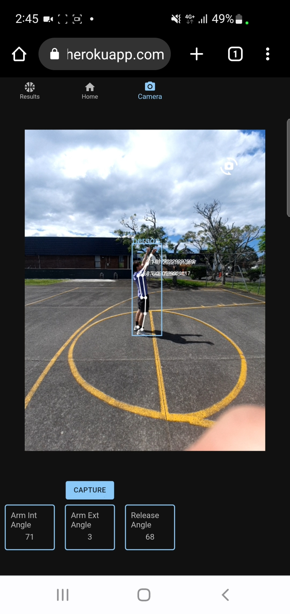
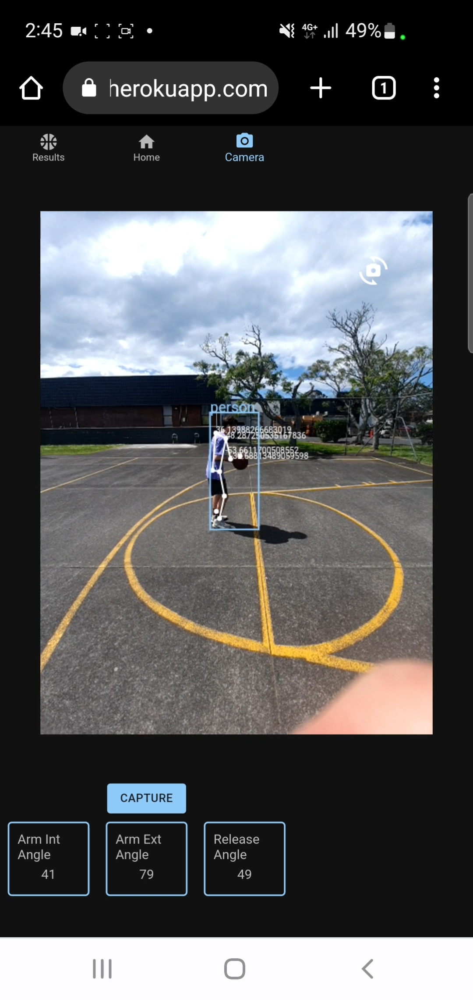
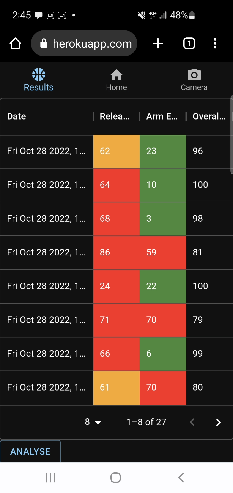

<a name="readme-top"></a>
## MSDwebapp Shooter


MSDwebapp is my React app project aimed at helping players develop a consistant jumpshot. Utilizing tensorflow's posenet to identify body positioning, an analysis of a basketball players form can take place, providing the ability to give the user statistical results in order to help improve their jumpshot form thus scoring potential.

This web app can be run either on your computer or mobile at [https://msdshooter.herokuapp.com ](https://msdshooter.herokuapp.com ).
Users will be able to create an account allowing for a history of statistical results to be kept which allows for a visual representation of their progression.

*Note: if you are planning to run the web app on your mobile ensure your connection is secure eg. using https. Otherwiese the camera will not work, therefore analysis cannot take place

What has been developed:
* Creation of accounts
* Live object tracking
* Live pose tracking
* Ability to capture current shot data (currently just arm angles)
* View all your previous shot data


### Built With

* React library
* Firebase for Auth + Firestore
* Heroku for hosting
* TensorFlow.js models


<!-- GETTING STARTED -->
## Installation

If you want to build the project rathan than accessing the hosted version follow these steps
1. Clone the repo
   ```sh
   git clone https://github.com/CamGham/MSDwebapp.git
   ```
2. Install Backend NPM packages
   ```sh
   npm run prepare-backend
   ```
3. Install Frontend NPM packages
   ```sh
   npm run prepare-frontend
   ```
4. Run the app
   ```sh
   cd frontend
   ```
    ```sh
   npm start
   ```
<p align="right">(<a href="#readme-top">back to top</a>)</p>


<!-- USAGE EXAMPLES -->
## Usage





<p align="right">(<a href="#readme-top">back to top</a>)</p>


[shooter-screenshot]: images/img2.jpg
[React.js]: https://img.shields.io/badge/React-20232A?style=for-the-badge&logo=react&logoColor=61DAFB
[React-url]: https://reactjs.org/
